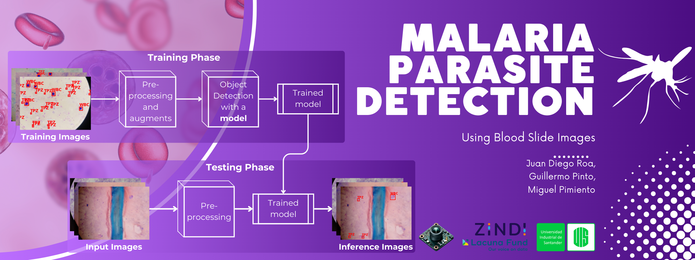

<div align="center">

# Malaria Parasite Detection and Classification  
**Using Blood Slide Images**

[](https://zindi.africa/competitions/lacuna-malaria-detection-challenge)

**Authors:** [Guillermo Pinto](https://github.com/guillepinto), [Miguel Pimiento](https://github.com/pimientoyolo125), [Juan Diego Roa]()  
**Research Group:** [Hands-on Computer Vision](https://github.com/semilleroCV)  

</div>

---

### Objective  
Develop a deep learning-based system to detect malaria parasites in blood slide images, focusing on classifying infected and uninfected cells at the trophozoite stage.

---

### Dataset  
- **[Malaria Blood Smear Dataset](https://drive.google.com/file/d/16T40TdpaB8VXohm50SySREwrzbuPcJBC/view):**  
  - Includes images of blood slides with infected and uninfected cells.  
  - Properly formatted for training detection and classification models.

---

### Models  
- **Object Detection:** Leveraging **[Transformers](transformers-no-trainer.ipynb) (DETR) and [YOLOs](yolos.ipynb)** for good performance.  
- **Supervised Training:** Advanced configurations like mixed precision and checkpoint resumption.  
- **Experiment Management:** Tracking and logging with **Weights & Biases (W&B)**.  

---

### Key Links  
- **Code:** [GitHub Repository](https://github.com/guillepinto/Malaria-Object-Detection-AI.git)  
- **Video Explanation:** [YouTube Presentation](#)  
- **Slides:** [Download Here](#)  

---

### Initial Setup  

1. **Clone the repository and set up the environment:**  
   ```bash
   git clone https://github.com/guillepinto/Malaria-Object-Detection-AI.git
   cd Malaria-Object-Detection-AI

   # Create and activate the virtual environment
   make create_environment

   # Install required dependencies
   make requirements
   ```

2. **Log in to Hugging Face and W&B:**  
   ```bash
   huggingface-cli login
   wandb login
   ```

3. **Dataset usage:**  
   - Ensure you provide the full dataset name with the `--dataset_name` argument.  
   Example: `SemilleroCV/lacuna_malaria`.

---

### Project Organization  

```plaintext
├── LICENSE            <- Open-source license (if applicable).  
├── README.md          <- This README file.  
├── notebooks          <- Jupyter notebooks for exploratory analysis and prototyping.  
├── scripts            <- Scripts for training and automated setup.  
├── src                <- Main source code for the project.  
│   ├── config.py      <- Configuration variables and parameters.  
│   ├── dataset.py     <- Scripts for dataset management.  
│   └── utils.py       <- General utility functions.  
├── models             <- Trained models and prediction results.  
├── make_submission.py <- Generates the final prediction file (submission.csv).  
└── requirements.txt   <- List of project dependencies.  
```

---

### Generating Predictions and Submission File  

1. To perform inference with a trained model, run the `make_submission.py` script:
   ```bash
   python make_submission.py --model_name SemilleroCV/facebook-detr-resnet-50-finetuned-malaria --test_dir_path test
   ```

2. The `submission.csv` file will be available in the project’s root directory.

<details>
<summary><strong>Additional Technical Information</strong></summary>

### Training Settings

- **{training settings}:** Information about training configurations such as batch size, augmentations, loss function, learning rate scheduler, and epochs/iterations. For example, `4xb4-ce-linearlr-40K` means using 4 GPUs, 4 images per GPU, CrossEntropy loss, Linear learning rate scheduler, and 40,000 iterations. Key abbreviations:
  - **{gpu x batch_per_gpu}:** GPUs and samples per GPU. For example:
    - `8xb2` = 8 GPUs × 2 images per GPU.
    - `4xb4` = Default setting (4 GPUs × 4 images per GPU).
  - **{schedule}:** Training schedule options, e.g., `20k` (20,000 iterations) or `40k` (40,000 iterations).

- **{training dataset information}:** Training dataset names like `cityscapes`, `ade20k`, and input resolutions. Example:
  - `cityscapes-768x768` means training on the Cityscapes dataset with an input shape of 768×768. It also includes augmentation details.

**Full Example:**  
`deeplabv3_r50-d8_4xb2-40k_cityscapes-512x1024`

---

### Running `run_object_detection_no_trainer.py` from the Script

To execute `run_object_detection_no_trainer.py` from a script located in the `scripts` folder while being in the root of the project, use the following command:

```bash
bash ./scripts/<your_script_name>.sh
```

Ensure the `.sh` script includes the correct parameters and paths relative to the root directory. The script will automatically call `run_object_detection_no_trainer.py` with the necessary arguments for training.

---

### Important Notes

- **Handling Negative Images (NEG):**
  - The dataset is properly structured. Negative images (those without objects) are represented by empty lists in all fields (`bbox`, `categories`, `id`, `area`), while positive images include the appropriate data.
  - For category mapping, only the actual classes (`{0: 'Trophozoite', 1: 'WBC'}`) are required. The model will learn when to predict objects and when not to during training.

- **Code Adjustments:**
  - **Line 136:** Changed the key for `objects` from `'category'` to `'categories'`.
  - **Line 477:** Passed the `categories` field manually.
  - **Continuing Training:** Resume training using the `--resume_from_checkpoint` parameter. For example:
    ```bash
    --resume_from_checkpoint detr-resnet-50-finetuned/epoch_0
    ```
  - **Model Requirements:** Any Hugging Face object detection model in `.safetensors` format with a properly configured `config.json` can be used.

- **Mixed Precision Training:**
  - If training begins without mixed precision and later `accelerate` is configured for mixed precision, it will fail due to the absence of a `scaler.pt` file. However, starting with mixed precision and disabling it later works seamlessly.

- **W&B Run Naming:**
  - To ensure that W&B names the run the same as `output_dir`, add the following to **line 621**:
    ```python
    wandb.run.name = args.output_dir
    ```

- **Pushing the Model to Hugging Face:**
  - To upload the model privately, set the `--hub_model_id` parameter:
    ```bash
    MODEL_ID="SemilleroCV/${OUTPUT_DIR}"
    ```
  - Additionally, set `private=True` on **line 443** when creating the repository.

</details>
